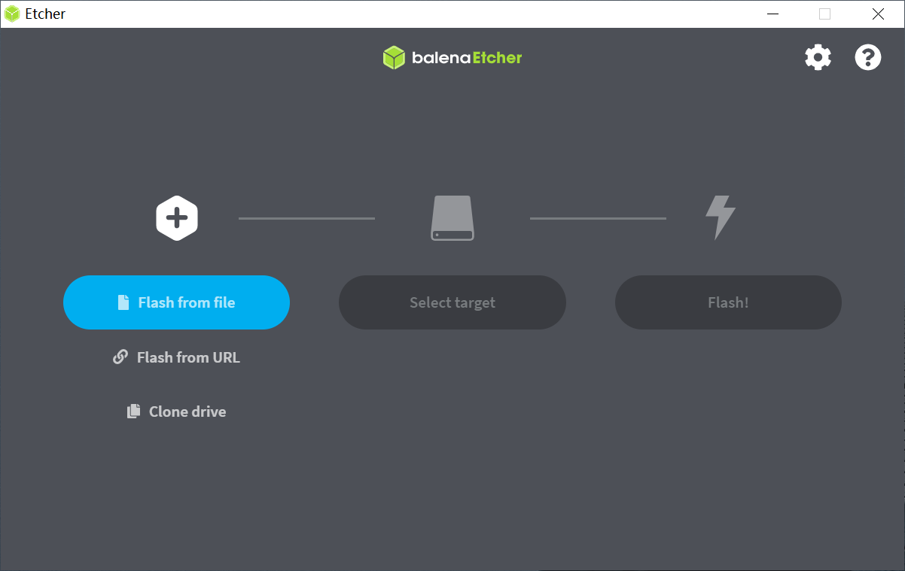
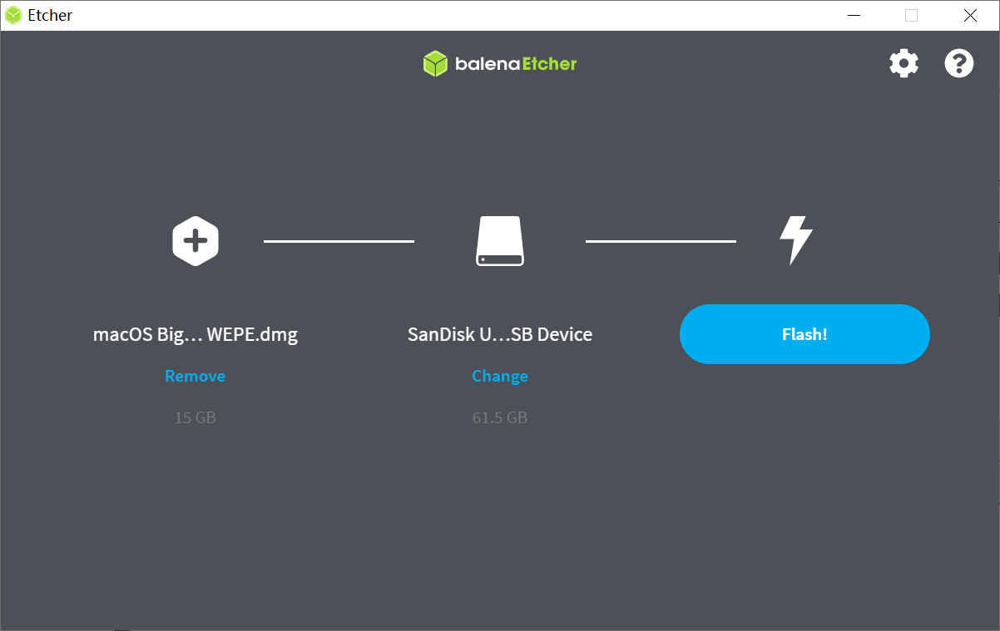
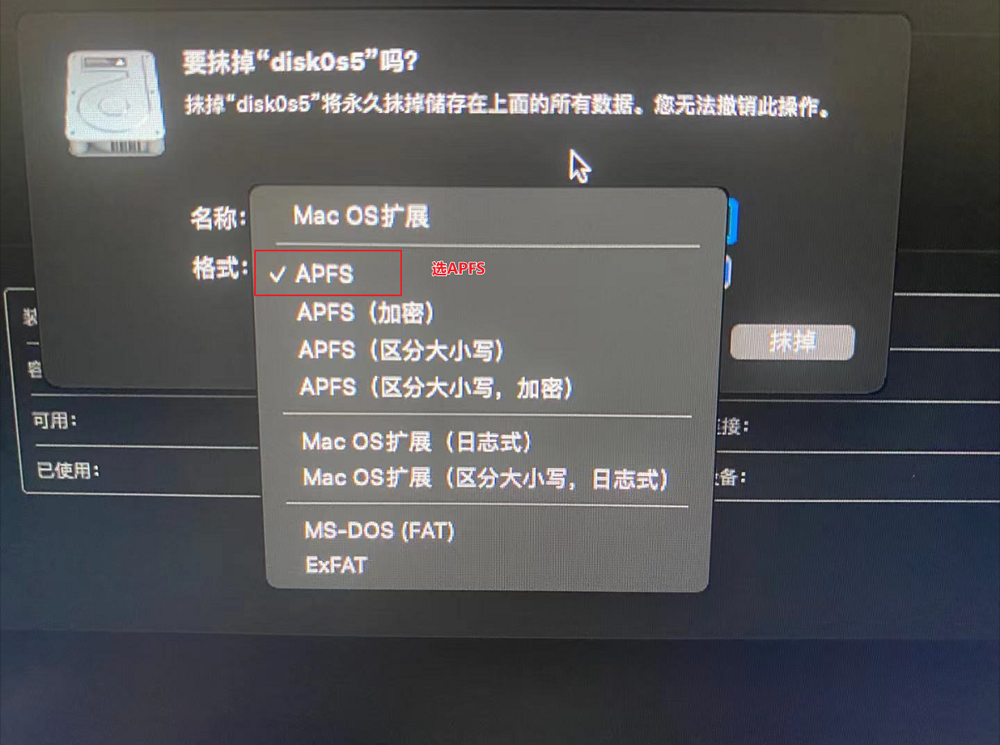
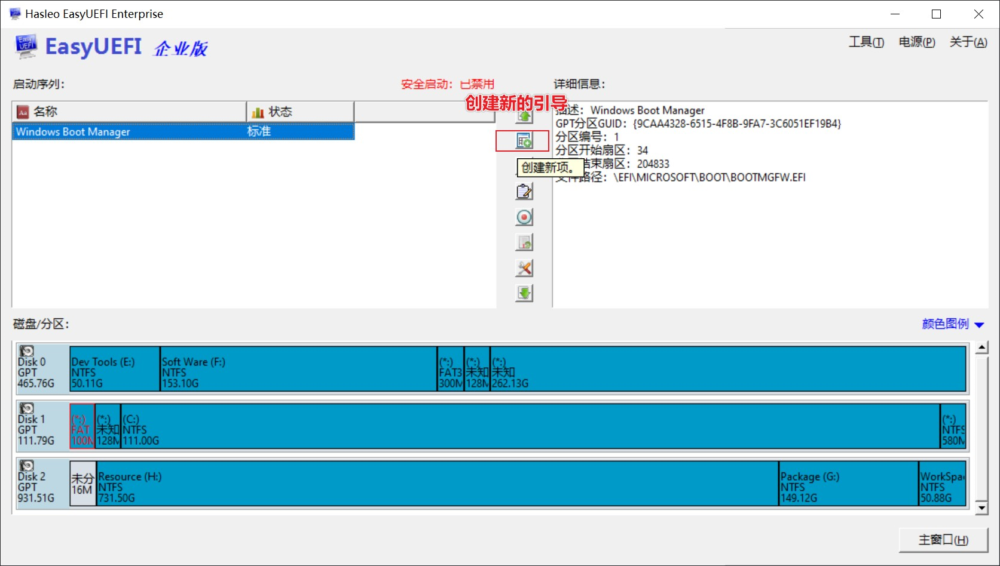

# 写在前面

> 文章在博客中会持续更新：https://www.ak47007.com/article/detail/nEJ7fm#/
>
> 我是打算Windows与Mac一起使用，所以我想出的办法是从磁盘中挤出一块空间装Mac，与Windows不冲突。
>
> **Tips：本文章只是给大家的一个参考，并不适用所有人的配置。**
>
> GitHub：https://github.com/ChinaDragonNB/HackApple
>
> 有问题请提 Issues。

时隔两年，再次想起玩黑苹果，从以前的`Clover`主流引导，到现在的`Open Core`引导，我发现遇到的问题并没有那么多了，以前用`Clover`做引导各种黑屏死机，现在倒也还算顺畅。`Clover`与`Open Core`并没有太大的区别，当然还是建议你多了解`Open Core`，以便于在遇到问题的时候能够自己动手解决。

关于`Open Core`参考文章：

- Open Core官方项目：https://github.com/acidanthera/OpenCorePkg/

* OC配置教程：https://dortania.github.io/OpenCore-Install-Guide/
* 基础配置：https://blog.xjn819.com/post/opencore-guide.html
* Clover转Open Core：https://blog.daliansky.net/From-Clover-To-OpenCore.html
* Open Core可视化图形编辑器：https://github.com/ic005k/QtOpenCoreConfig

给你们看一张我的黑果图：


# 硬件与配置

## 硬件

我的硬件除了显卡跟网络之外，都是兼容的，显卡可以通过刷Bios解决，无线网卡可以通过添加驱动解决，如果你是**有线连接**的话，就不需要另装驱动了。

|   硬件   |         型号          |                             说明                             |
| :------: | :-------------------: | :----------------------------------------------------------: |
|   主板   |   微星B360M MOTRAR    |                       需要修改Bios设置                       |
|   CPU    |  Intel Core i5-9400f  |                            无核显                            |
|   显卡   | 蓝宝石RX580 2048SP 8G | 黑苹果不免驱，已刷成RX570，可参考[显卡刷Bios](https://www.ak47007.com/article/detail/FBfaAv#/) |
|   SSD    |     希捷固态 500G     |          单独拉出来的分区，其他分区在Windows中使用           |
|   内存   |  金士顿骇客神条 16G   |               SSD与内存对黑苹果的影响应该不大                |
| 无线网卡 |  COMFAST AX200 wifi6  |                           需要驱动                           |
|  显示器  |  三星 U28R550UQC 4K   |                         影响应该不大                         |
|  扬声器  |      淘宝9.9包邮      |         主板音频接口坏了，用的显示器的音频接口，免驱         |

> 关于显卡刷BIOS，可以在我博客的另一篇文章中了解，刷BIOS的方式都差不多，只要找对合适的ROM就行，但刷BIOS有风险，显卡与ROM不兼容导致开机黑屏，CPU无核显先自备亮机卡再做测试，以防不测。
>
> 文章连接：https://www.ak47007.com/article/detail/FBfaAv#/

## 系统信息

|   名称    |     版本     |
| :-------: | :----------: |
|   MacOS   | Big Sur 11.6 |
| Open Core |    0.7.3     |

## 驱动信息

常见的驱动信息

|     名称      | 版本  |       说明        |
| :-----------: | :---: | :---------------: |
|   AppleALC    | 1.6.4 |     声卡驱动      |
|  IntelMausi   | 1.0.7 | Intel有线网卡驱动 |
|     Lilu      | 1.5.6 |     补丁驱动      |
| WhateverGreen | 1.5.4 |     视频驱动      |
| AirportItlwm  | 2.1.4 |   无线网卡驱动    |

# 参考文章

在这次的吃黑果过程中，我查询了很多的文章，在下面列出来，希望能对你也有所帮助：

* 黑苹果小兵：https://blog.daliansky.net/macOS-BigSur-11.6-20G165-Release-version-with-OC-0.7.3-and-Clover-5139-and-PE-original-image.html
* 黑苹果长期维护机型整理清单：https://blog.daliansky.net/Hackintosh-long-term-maintenance-model-checklist.html
* Hackintosh-MSI-B360M-MORTAR：https://github.com/ZzzM/Hackintosh-MSI-B360M-MORTAR
* MSI-B360M-MORTAR-IMACPRO-EFI：https://github.com/andot/MSI-B360M-MORTAR-IMACPRO-EFI
* MSI-B360M-MORTAR-HACKINTOSH-OPENCORE-EFI：https://github.com/GeQ1an/MSI-B360M-MORTAR-HACKINTOSH-OPENCORE-EFI
* 无线网卡ax200的黑苹果驱动教程：https://www.jianshu.com/p/cbc458eafb99

# 需要准备的东西

* 16G及以上U盘（镜像大小13G）
* MacOS镜像（来自黑苹果小兵），内置`Open Core`、`Clover`、`WEPE`：

  * OneDrive[世纪互联1]：[请点击下载](https://ilikemacos-my.sharepoint.cn/:u:/g/personal/ilikemacos_ilikemacos_partner_onmschina_cn/ET5fg5qhF-dBnuLrYGl-CLMBMDTk-N_xqmwOVG76sJkIbw?e=Yeleha)
  * OneDrive[世纪互联2]：[请点击下载](https://hongesttechnology-my.sharepoint.cn/:u:/g/personal/daliansky_hongesttechnology_partner_onmschina_cn1/EQs1aFfholZPrSBqAqMIf6kB_gHlyglKIK-3CYUcrIrHnQ?e=DixHQX)
  * 迅雷离线下载：[[请点击下载](https://mirrors.dtops.cc/ISO/MacOS/macOS Big Sur 11.6 20G165 Installer for CLOVER 5139 and WEPE.dmg)] 感谢`@难忘情怀`提供下载资源
  * 天翼云盘：[[请点击下载](https://cloud.189.cn/web/share?code=3uUrm2MJ7Nfa)]
* balenaEtcher（镜像写入工具）：https://www.balena.io/etcher/
* OC Auxiliary Tools（Open Core配置工具，Windows中使用）：https://github.com/ic005k/QtOpenCoreConfig/releases
* Open Core Configurator（Open Core配置工具，Mac中使用）：https://links.jianshu.com/go?to=https%3A%2F%2Fmackie100projects.altervista.org%2F
* Disk Genius（硬盘分区工具）：https://www.diskgenius.cn/
* EasyUEFI（引导配置工具）：https://www.easyuefi.com/

---

EasyUEFI、我的EFI放到下面云盘了，其他东西在官网都能下载到。

> https://wws.lanzoui.com/b020km9ih
> 密码:6hw2


# 写入镜像

写入镜像完全是傻瓜式操作，以前我记得还得用TranMac做处理。

## 1. 打开balenaEtcher



## 2. 选择MacOS镜像

点击**Flash from File**选择镜像


## 3. 选择U盘

点击**Select target**选择U盘




## 4. 等待完成

选完镜像跟U盘后，点击**Flash!**，之后等他写入成功即可。

# Open Core配置

写入镜像后需要对EFI进行一些配置，同时也可以熟悉一些软件的操作。

## 1. 备份EFI

将引导的EFI复制到桌面，然后备份一份，然后对复制到桌面的文件进行修改。


## 2.删除驱动

无线网卡驱动有两个版本可选：`itlwm`和`AirportItlwm`。我这里用的是`AirportItlwm`，`itlwm`驱动不起来，两者一起用也驱动不起来，他们的区别可以查看文档：[https://openintelwireless.github.io/itlwm/FAQ.html#installation](https://links.jianshu.com/go?to=https%3A%2F%2Fopenintelwireless.github.io%2Fitlwm%2FFAQ.html%23installation)，具体`itlwm`不能驱动的原因尚且未知，但写入的这个镜像的EFI里带有这个驱动，所以需要把他删了，如果你用`AirportItlwm`无法驱动无线网卡的话，可以试试`itlwm`，或者两个一起用。

> 驱动路径（复制到桌面的）：\EFI\OC\Kexts\itlwm.kext

## 3. 驱动配置

打开**OCAuxiliaryTools**


点击左上角的**文件** ----->  **打开**，然后选择`config.plist`配置文件

> 文件路径（复制到桌面的）：\EFI\OC\config.plist

一开始进来是这样的


## 4. 禁用驱动

这一步是禁用USB驱动，我的鼠标跟键盘在进行MacOS安装的时候无法使用，禁用就行了，如果你的禁用后不能使用了，那么就需要重新启用。


## 5. 添加驱动

这一步是添加无线网卡驱动，如果你不用无线的话，可以略过这一步。


> 驱动路径（复制到桌面的）：\EFI\OC\Kexts\AirportItlwm.kext


## 6. 保存

操作完不要忘记保存配置，可以按**Ctrl + S**或者点击左上角的**文件 -----> 保存**

## 7. 替换启动EFI

最后将更改的东西替换到U盘里面的EFI中，为了保证文件会被替换，我一般是会先把U盘里的EFI文件夹删了，然后将桌面的EFI文件夹复制进去。

# 主板BIOS设置

## 微星主板设置

参考文章：https://github.com/GeQ1an/MSI-B360M-MORTAR-HACKINTOSH-OPENCORE-EFI#%E4%BD%BF%E7%94%A8-efi

GitHub在国内可能访问比较慢，我就将内容复制过来了。

> ### BIOS 设置
>
> *请先确定正在使用的 BIOS 版本，[迫击炮](https://cn.msi.com/Motherboard/support/B360M-MORTAR) 7B23v16 以上，[迫击炮钛金版](https://cn.msi.com/Motherboard/support/B360M-MORTAR-TITANIUM) 7B23vA6 以上，否则请参考官方文档升级 BIOS 至最新版本（v19 & vA9 版本可用）。*
>
> SETTINGS\高级\PCI子系统设置\Above 4G memory/Crypto Currency mining [允许]
>
> SETTINGS\高级\内建显示配置\设置第一显卡 [PEG]*（仅同时拥有核显及独显需要手动设置）*
> SETTINGS\高级\内建显示配置\集显共享内存 [64M]*（如果使用拥有核显的处理器）*
> SETTINGS\高级\内建显示配置\集成显卡多显示器 [允许]*（如果使用拥有核显的处理器）*
>
> SETTINGS\高级\ACPI设置\电源 LED 灯 [双色]*（如果选择 [闪烁]，睡眠时电源灯将不断闪烁）*
>
> SETTINGS\高级\整合周边设备\SATA设置\SATA模式 [AHCI模式]*（如果选择 Optane 模式则无法识别硬盘）*
>
> SETTINGS\高级\USB设置\XHCI Hand-off [允许]
> SETTINGS\高级\USB设置\传统USB支持 [允许]
>
> SETTINGS\高级\电源管理设置\ErP Ready [允许]
>
> SETTINGS\高级\Windows操作系统的配置\Windows 10 WHQL支持 [允许]*（开启为「纯」UEFI 模式，否则为「兼容」UEFI 模式，推荐设置为允许）*
> SETTINGS\高级\Windows操作系统的配置\MSI 快速开机 [禁止]
> SETTINGS\高级\Windows操作系统的配置\快速开机 [禁止]
>
> SETTINGS\高级\唤醒事件设置\唤醒事件管理 [BIOS]
> SETTINGS\高级\唤醒事件设置\USB设备从S3/S4/S5唤醒 [允许]
>
> SETTINGS\启动\启动NumLock状态 [关]*（macOS 默认可使用数字键盘，只有 macOS 的话推荐关闭）*
> SETTINGS\启动\启动模式选择 [UEFI]
>
> OC(Overclocking)\CPU 特征\Intel 虚拟化技术 [允许]*（必须）*
> OC(Overclocking)\CPU 特征\Intel VT-D 技术 [禁止]*（必须）*
> OC(Overclocking)\CPU 特征\CFG锁定 [禁止]*（必须）*

我设置后的提示：


## 其他主板设置

其他主板的Bios我也不太懂，可以参考上面微星主板的设置与下面的内容进行操作

参考文章：https://blog.daliansky.net/macOS-BigSur-11.6-20G165-Release-version-with-OC-0.7.3-and-Clover-5139-and-PE-original-image.html

> ## BIOS设置选项列表
>
> ### 禁用清单
>
> - `Fast Boot` - 快速启动
> - `VT-d` (can be enabled if you set DisableIoMapper to YES) - VT-d（如果DisableIOMapper Quicks设置为YES，则可以启用）
> - `CSM` - CSM 兼容性支持模块
> - `Thunderbolt` - 雷雳
> - `Intel SGX` - 英特尔SGX
> - `Intel Platform Trust`- 英特尔平台信任
> - `CFG Lock` (MSR 0xE2 write protection) - CFG锁（MSR 0xE2写保护）（必须关闭，如果找不到该选项，则在OpenCore的config-内核-> Quirks下启用与CFG Lock相关选项）
> - `ecure Boot` - 安全启动
> - `Parallel Port` - 并口
> - `Serial/COM Port` - 串行/COM端口
>
> ### 启用
>
> - `VT-x` - VT-x
> - `UEFI Boot Mode` UEFI启动模式。请不要使用Legacy
> - 硬盘模式：改为`AHCI`。不能用IDE和RST RAID。
> - `Above 4G decoding` - 大于4G地址空间解码
> - `Hyper-Threading` - 超线程
> - `Execute Disable Bit` - 执行禁用位
> - `EHCI/XHCI Hand-off` - EHCI / XHCI接手控制
> - `OS type`: `Windows 8.1/10 UEFI Mode` - 操作系统类型：Windows 8.1 / 10 UEFI模式
> - `DVMT Pre-Allocated`(iGPU Memory): DVMT预分配（iGPU内存）：`64MB`（如果能设Max就设）
> - `Legacy RTC Device` - 传统RTC设备

需要设置的内容的差不多。

# 硬盘分区

## 1. 挤出空闲空间

从硬盘中挤出一些空间来作为Mac系统使用。


## 2. 创建引导分区

创建ESP/MSR分区，来做最后的引导使用，


给的大小默认的就行。


## 3. 创建MAC分区


## 4. 保存更改

分区完后点左上角的保存更改，遇到格式化的提示，点是就行。

下图为分区后的磁盘信息。


# 启动引导选择

重启电脑，根据自己的主板按下合适的键进入BIOS界面，微星主板是按**F11**。


如上图所示，第一个选项是Windows的启动引导，默认也是它，所以我们开机就会自动启动Windows，如果想开机默认启动MacOS，需要给它做引导，并设置它的顺序在第一位。

第二个选项是黑苹果的OC（Open Core）启动引导，如果你们没有删除U盘里另外两个分区的话，那你们显示的U盘分区应该有三个（OC、Clover、WEPE）。

# 适配EFI

我用的是镜像自带的EFI，没有什么问题。我试过其他人的EFI，出现了引导失败的问题：


正常的引导界面是这样的：


如果你没有出现这个界面，就要考虑自己的EFI的兼容问题了，我找到了一个跟我的硬件比较类似的，但是他的EFI对我来说并不合适，所以出现了引导失败的界面。

参考EFI：https://github.com/ZzzM/Hackintosh-MSI-B360M-MORTAR，如果这个跟你的差别比较大的话，可以在GitHub上面搜搜你的**主板+CPU+黑苹果**关键字。

# 安装黑苹果

**由于我的显示器比较大，显示出来的字体会比较小，拍出来的照片并不会很清晰，请多谅解。**

## 1. 开始安装

进入引导后选第二个 **Install macOS Big Sur**


选了这个之后就会出现一堆代码日志


## 2. 安装预览

进入这个界面，说明你的EFI基本上没有问题了，如果没有是黑屏，或者其他错误界面，那么可以考虑EFI的兼容问题了，可以换一个EFI再重试。


## 3. 抹掉磁盘

之前新建的MAC分区只是让MAC系统能够识别，但并不能直接将系统安装到该分区中，所以需要做一次抹盘处理，抹盘可以使用MAC系统自带的磁盘工具。


### 3.1 磁盘工具预览

打开工具之后，可以看到硬盘的各个分区及之前用DG格式化的MAC分区。


### 3.2 抹掉磁盘

然后右键选择这个MAC分区，并选择抹掉。


### 3.3 磁盘格式选择

将磁盘抹成APFS格式。



### 3.4 磁盘格式说明

格式说明可参考：https://support.apple.com/zh-cn/guide/disk-utility/dsku19ed921c/mac

* *Apple 文件系统 (APFS)：*macOS 10.13 或后续版本使用的文件系统。
  * *APFS：*使用 APFS 格式。如果不需要加密或区分大小写格式，请选取此选项。
  * *APFS（加密）：*使用 APFS 格式且加密宗卷。
  * *APFS（区分大小写）：*使用 APFS 格式并区分文件和文件夹名称的大小写。例如，名称为“Homework”和“HOMEWORK”的文件夹是两个不同的文件夹。
  * *APFS（区分大小写，加密）：*使用 APFS 格式，区分文件和文件夹名称的大小写且加密宗卷。例如，名称为“Homework”和“HOMEWORK”的文件夹是两个不同的文件夹。
* *Mac OS 扩展：*macOS 10.12 或之前版本使用的文件系统。
* *MS-DOS (FAT) 和 ExFAT：*与 Windows 兼容的文件系统。

## 4. 抹磁完成

抹掉后的磁盘图


## 5. 安装

抹磁完成后，Mac系统就能安装到该分区中，可以进行下一步了。

### 5.1 安装


### 5.2 选择分区

同一条款后，选择抹掉的分区，将系统安装到该分区上。


### 5.3 安装过程说明

安装过程比较慢，并且在途中可能会出现重启，这都是正常现象，重新安装就行。需要注意的是 **Install macOS Big Sur 选项的右边**会不会多出来一个选项，如果多出来一个就选这个，如果没有多出来，就继续选 **Install macOS Big Sur**。

不过如果你在某一步重启了很多次都没有成功，也可以将问题推EFI身上，换一个EFI试试。


下图为安装过程中重启，然后多出来一个选项，直接选择多出来的选项继续安装就行。


下图为初步将系统安装到分区成功，但并没有完全安装成功，所以还需要选择这个分区继续接下来的安装。


## 6. 安装成功

多次重启后，终于安装成功了，出现了下图的界面。


之后，根据Mac的提示进行系统的初始化操作就可以了。

# 开始使用

安装成功后，查看自己经常使用的功能是否正常，如果有问题需要自己查询文章解决。最后放几张配置图。


## 2. 配置EFI

打开EasyUEFI工具添加一个新的引导



把类型选一下，描述（在启动BIOS中显示的名称）填一下，然后选中ESP分区。


之后浏览文件，将efi配置文件选中。


## 3. 完成

添加引导之后的样子。


重启电脑进入BIOS也可以看到该引导了。


如果你想默认启动电脑进入MacOS系统的话，就把黑苹果引导移到第一位就行。

# 问题

毕竟不是白苹果，遇到一些问题也是正常的，去解决就行了。在此我列出了一些常见的问题，并提供了解决办法，以后在使用过程中遇到的问题，我会在博客中记录。请留意文章：https://www.ak47007.com/article/detail/nEJ7fm#/

## 黑苹果与Windows时间不一致

参考文章：https://www.jianshu.com/p/a1bb585832e6

> **复制大法**
>
> windows下管理员模式运行cmd或者powershell，输入下面的命令
>
> ```bash
> Reg add HKLM\SYSTEM\CurrentControlSet\Control\TimeZoneInformation /v RealTimeIsUniversal /t REG_DWORD /d 1
> ```

